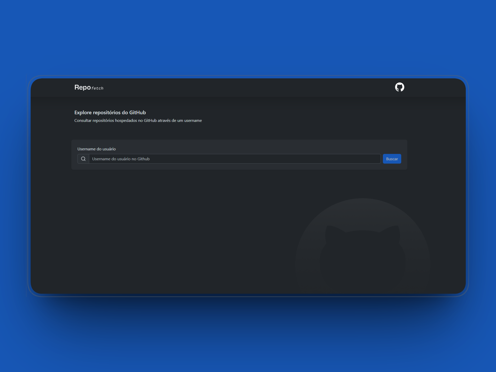
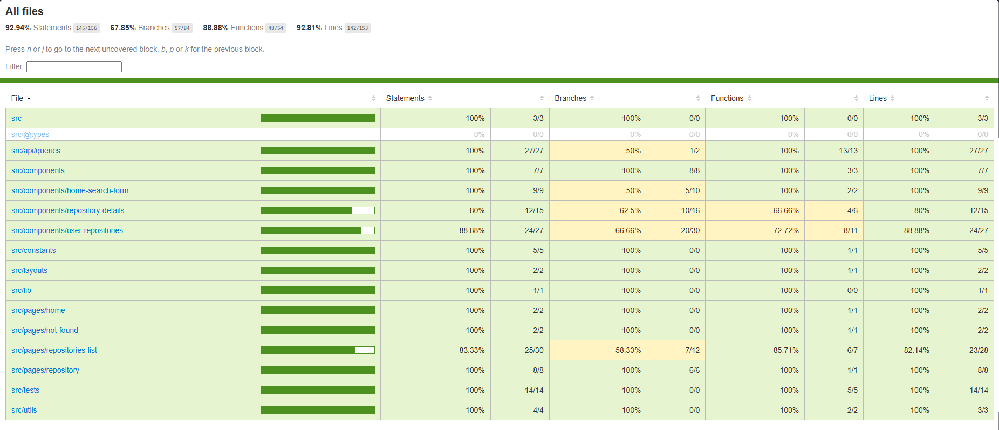

<p align="center">
  
</p>

<p align="center">
  <strong>
    Aplicação web para explorar repositórios dado um username
  </strong>
</p>

> [!IMPORTANT]
> 👉🏻 Acesse a demo em: [repo-fetch-ivory.vercel.app](repo-fetch-ivory.vercel.app)

<p>&nbsp;</p>

<p align="center">
  
</p>

<p>&nbsp;</p>

<p align="center">
  

  

  
</p>

<p align="center">
  <a href="#computer-features">Funcionalidades</a>&nbsp;&nbsp;&nbsp;|&nbsp;&nbsp;&nbsp;
  <a href="#gear-settings">Configurações</a>&nbsp;&nbsp;&nbsp;|&nbsp;&nbsp;&nbsp;
  <a href="#arrow_down_small-cloning-the-repository">Clonando a aplicação</a>&nbsp;&nbsp;&nbsp;|&nbsp;&nbsp;&nbsp;
  <a href="#beginner-starting-the-application">Iniciando a aplicação</a>&nbsp;&nbsp;&nbsp;|&nbsp;&nbsp;&nbsp;
  <a href="#test_tube-running-the-tests">Executando os testes</a>&nbsp;&nbsp;&nbsp;|&nbsp;&nbsp;&nbsp;
  <a href="#wrench-techs--tools--resources">Techs | Tools | Recursos</a>&nbsp;&nbsp;&nbsp;|&nbsp;&nbsp;&nbsp;
  <a href="#memo-license">Licença</a>
</p>

### :pushpin: Contexto

**Repo Fetch** é uma aplicação web desenvolvida com o framework [Vite](https://vite.dev/), usa a API do GitHub [GitHub API](https://docs.github.com/en/rest) e foi criada como desafio técnico para a posição de pessoa desenvolvedora frontend.

> [!NOTE]
> Alguns _endpoints_ informados nas orientações do desafio não estavam funcionais e foram utilizados outros para buscar pelas informações necessárias e atender aos requisitos solicitados.

**Principais premissas e escolhas**

1) Foi usado TypeScript, pois podemos otimizar tempo de desenvolvimento com _typos_ e outros erros, o _IntelliSense funciona melhor, o que fera uma melhor experiência de desenvolvimento.

2) Foi utilizado o framework Bootstrap como solicitado nos requisitos do desafio.

3) Também usei a _lib_ TanStack React Query, pois acredito que ela torna as requisições e o _caching_ das mesma mais fácil de gerir. Ela foi usada em conjunto com a _lib_ Axios, que foi informado como uma preferência de implementação.

4) As funcionalidades foram implementadas conforme os requisitos do desafio.

5) Para o _deploy_ eu uei a plataforma da Vercel porque a experiência é fluida, simples e atende às necessidades do projeto.

### :computer: Funcionalidades

**Done**

- [x] Home page com formulário para informar o _username_ da pessoa no GitHub e buscar pelos dados;
- [x] Página de detalhes do usuário informado com a lista dos seus repositórios;
- [x] Funcionalidades na lista de repositórios: order por estrelas, pesquisar por repositório, buscar por mais repositórios (paginação de 10 items por página);
- [x] Página de detalhes do repositório;
- [x] Página 404 para redirecionamento em caso de usuário ou repositório não encontrado;
- [x] Utilização de rotas para navegação;
- [x] Páginas responsivas;
- [x] Unit / integration testes usando Vitest e React Testing Library.

<p align="center">
  
</p>

### :gear: Configurações

As configurações necessárias para executar a aplicação são:

- [Git](https://git-scm.com);
- [Node](https://nodejs.org/);
- [Npm](https://www.npmjs.com/).

### :arrow_down_small: Clonando o repositório

1. No seu terminal navegue até a pasta onde você gostaria de clonar o repositório e execute o seguinte comando:

```bash
# cloning the repository
git clone https://github.com/belapferreira/repo-fetch.git
```

### :beginner: Iniciando a aplicação

1. Abra o código clonado, duplique o arquivo `.env.example` e renomeie para `.env.local`. 

2. Confirme que a URL da API do GitHub existe na variável `VITE_API_URL`. Se não existir, é necessário incluir.

3. No seu terminal navegue até a pasta onde você clonou o repositório e execute os seguintes comandos:

```bash
# installing dependencies
npm install

# starting application
npm run dev
```

### :test_tube: Executando os testes

1. No seu terminal navegue até a pasta onde você clonou o repositório e execute o seguinte comando:

```bash
# running unit tests
npm run test
```

### :wrench: Techs | Tools | Recursos

Os principais recursos usados para o desenvolvimento do projeto foram:

-  [Axios](https://axios-http.com/ptbr/docs/intro)
-  [Bootstrap](https://getbootstrap.com/)
-  [Eslint](https://eslint.org/)
-  [Lucide](https://lucide.dev/guide/react/)
-  [React Hook Form](https://www.react-hook-form.com/)
-  [React Router Dom](https://reactrouter.com/)
-  [TanStack Query](https://tanstack.com/query/latest)
-  [TypeScript](https://www.typescriptlang.org/)
-  [Vite](https://vite.dev/)
-  [Vitest](https://vitest.dev/)
-  [Zod](https://zod.dev/)


### :memo: Licença

MIT license. Acesse [LICENSE](https://github.com/belapferreira/repo-fetch/blob/master/LICENSE) para mais informações.

---

Desenvolvido por Bela Ferreira :blue_heart: Contato: https://www.linkedin.com/in/belapferreira :blush:
